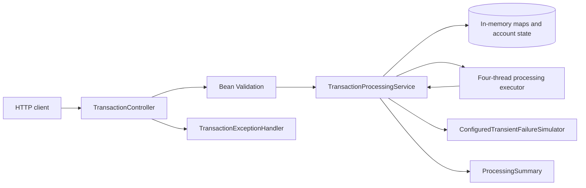
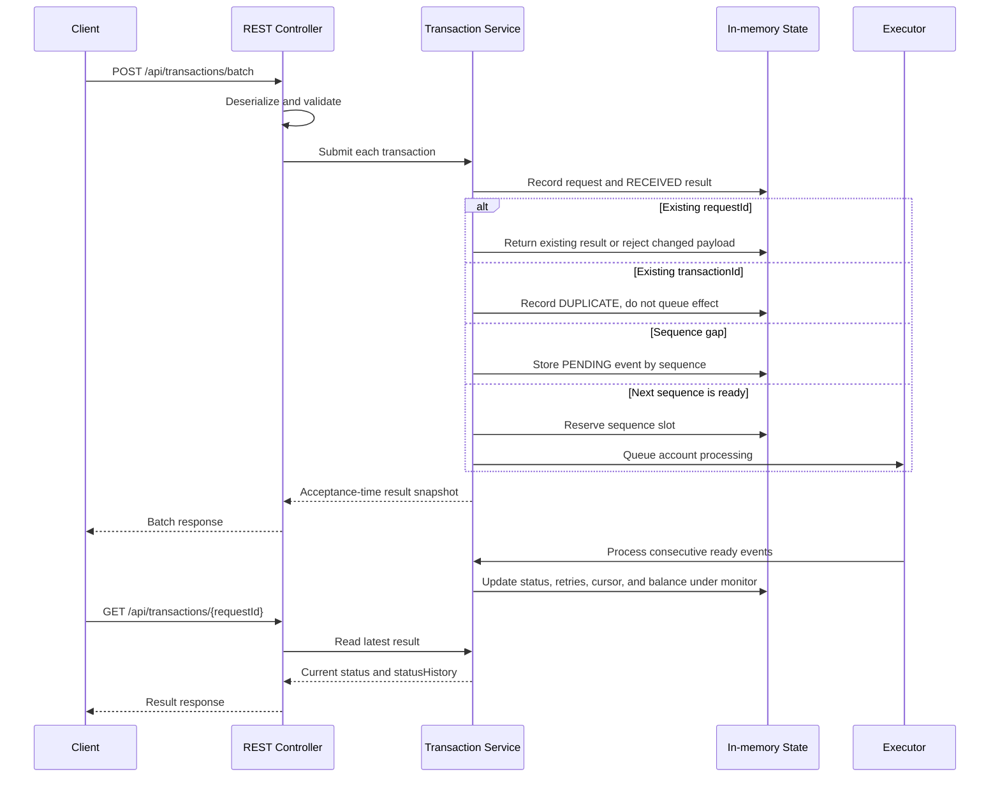
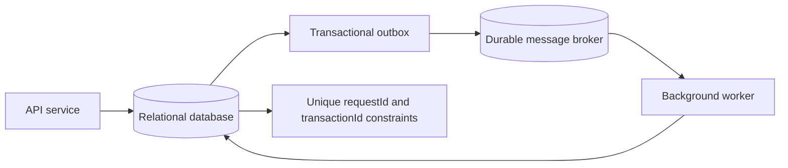

# Design Explanation

## Scope

This design documents the current source and separates implemented behavior from future production improvements. The service is an in-memory, single-JVM assessment implementation. It is not durable, distributed-safe, or production-ready.

## Architecture

### Implemented responsibilities

- `TransactionController` maps batch submission, request-result lookup, and processing summary.
- `TransactionRequest` and `TransactionBatchRequest` define Jakarta Bean Validation constraints. `TransactionResult` returns current status, history, attempt count, message, and request fields.
- `TransactionProcessingService` owns request/business-ID maps, result state, per-account sequence cursors, pending events, and currency balances. Public mutations and worker processing are synchronized.
- `TransactionProcessingConfiguration` provides a fixed four-thread executor. Ready work is queued after the service records its initial state.
- `ConfiguredTransientFailureSimulator` reads `transaction.simulated-failures` at startup and fails a fixed number of initial attempts for every transaction.
- `TransactionExceptionHandler` maps selected service errors to `ApiError`; Spring MVC handles request-body conversion and validation errors.

## Processing flow

## Lifecycle and states

An accepted request begins `RECEIVED`. A missing predecessor leaves it `PENDING`. Ready work is queued to the executor and becomes `PROCESSING`. Success becomes `PROCESSED`. Transient simulated failures record `RETRY_PENDING` between attempts; retry exhaustion, insufficient funds, stale sequence, and sequence-slot collision become `FAILED`. A previously reserved business ID under another request ID becomes `DUPLICATE`.

The `status` field and summary represent the latest state; `statusHistory` captures transitions. The POST response is a snapshot taken before the worker can acquire the service monitor, so a ready event normally returns `RECEIVED`. Poll `GET /api/transactions/{requestId}` for completion. `RETRY_PENDING` is short-lived: attempts run immediately in the same worker invocation, with no delay/backoff.

## Idempotency and financial-effect protection

`requestId` identifies a caller submission. Equal record payload replay returns the current stored result; a different payload with the same request ID raises a conflict (HTTP 409). Java record equality applies, including scale-sensitive `BigDecimal.equals`: `1.0` and `1.00` are not equal payload fields.

`transactionId` identifies the business effect. It is globally reserved in the current process, not scoped per account. A different `requestId` with an existing transaction ID receives `DUPLICATE` and is not placed on the account queue. That prevents a second balance effect during the current process lifetime.

The reservation is recorded after request validation and before account sequence checks. A request that is subsequently marked `FAILED` for a stale or occupied sequence still reserves its `transactionId`; retrying the corrected event with another request ID will therefore return `DUPLICATE`. Replaying the original request ID and equal payload returns the stored failed result. This ordering is a limitation of the current implementation and should be revisited for a production correction/replay policy.

Synchronized service methods serialize the in-memory reservation, result update, account sequencing, and balance mutation against other threads in this JVM. This is not an ACID transaction: process failure can erase state, and multiple instances do not share a lock or ID registry.

## Sequence handling

Each account starts at sequence 1. The next acceptable sequence is `lastSequenceNumber + 1`; sequence numbers are account-wide, while balances are separately held per currency. A higher sequence is stored in a `TreeMap` as `PENDING`. Missing sequence numbers are never skipped automatically. When the next expected transaction is queued, the worker processes it and drains any immediately consecutive pending events.

Insufficient-funds failures and retry exhaustion consume their sequence position so a later pending event can continue. An event behind the cursor fails. A different event cannot replace an event already occupying the same pending/ready slot. Business duplicates are not queued and consume no sequence position.

## Retry behavior

`MAX_ATTEMPTS` is three. `transaction.simulated-failures=0` disables injected failures; `1` fails the first attempt and then succeeds; `3` exhausts all attempts. The setting applies to every transaction and is read at startup. Each transient failure records `RETRY_PENDING`; after exhaustion, result status is `FAILED`, balance remains unchanged, and the account cursor advances.

This deterministic simulator is demonstration behavior, not production failure handling. Real retry policies should classify errors, use bounded backoff with jitter, and persist attempts and dead-letter state.

## Concurrency, errors, and observability

The executor has four worker threads, but workers contend on one synchronized service state, serializing processing across accounts while the monitor is held. This is simple for the assessment but limits throughput. The ready-sequence occupancy check protects against concurrent submissions overwriting a queued event at the same sequence.

Custom service errors map to HTTP 400 (`InvalidTransactionException`), 404 (`TransactionNotFoundException`), and 409 (`DuplicateRequestIdException`). Malformed JSON and request Bean Validation failures receive HTTP 400 from Spring MVC's default handling. Business outcomes such as insufficient funds are transaction results with status `FAILED`, not HTTP error responses.

The API provides status history, attempts, messages, status counts, account count, and balances. There are no transaction-specific application logs, metrics, traces, audit records, or custom health endpoints.

## In-memory trade-offs and restart behavior

The in-memory maps avoid infrastructure and make the behavior easy to demonstrate, but they are volatile and unbounded. Restart loses balances, sequence positions, pending events, idempotency IDs, results, and summary counts. No work is recovered. Separate instances can accept the same IDs and apply the effect independently. Batch submission is not all-or-nothing; earlier entries may have been accepted before a later service-level conflict aborts processing.

## Future production architecture (not implemented)

Persist request/idempotency records, transaction lifecycle, account cursors, pending work, and ledger entries. Enforce unique constraints for request and business IDs. In one database transaction, lock or version-check the account row, validate sequence, apply the ledger effect, advance its cursor, and update idempotency/result state. Use a transactional outbox to publish durable work; workers should be idempotent and maintain an inbox/deduplication record. Persist retry and dead-letter state.

With that architecture, restart can reload pending work and resume safely. The current app has no recovery: all in-memory state disappears on restart.

## Assumptions and decisions

- Sequences are positive, contiguous, account-wide, and start at 1.
- New account/currency balances start at zero; there is no funding endpoint.
- Zero amount is accepted; negative amount is rejected.
- Currency validation checks only `[A-Z]{3}`; no ISO registry, scale, or rounding is applied.
- Business transaction IDs are globally unique in this process.
- Only `CREDIT` and `DEBIT` are implemented; `REVERSAL` is not supported. The original assessment brief names the transaction type field but does not define reversal semantics.
- Tests cover a successful credit followed by a successful debit and the resulting balance, as well as insufficient-funds debit behavior.
- Missing sequences are not skipped; failed in-order transactions advance the cursor.
- HTTP request Bean Validation happens before controller invocation. Batch business processing is not an all-or-nothing transaction.
- Atomicity/concurrency guarantees apply only inside one running JVM. The database and broker architecture above is a future improvement.